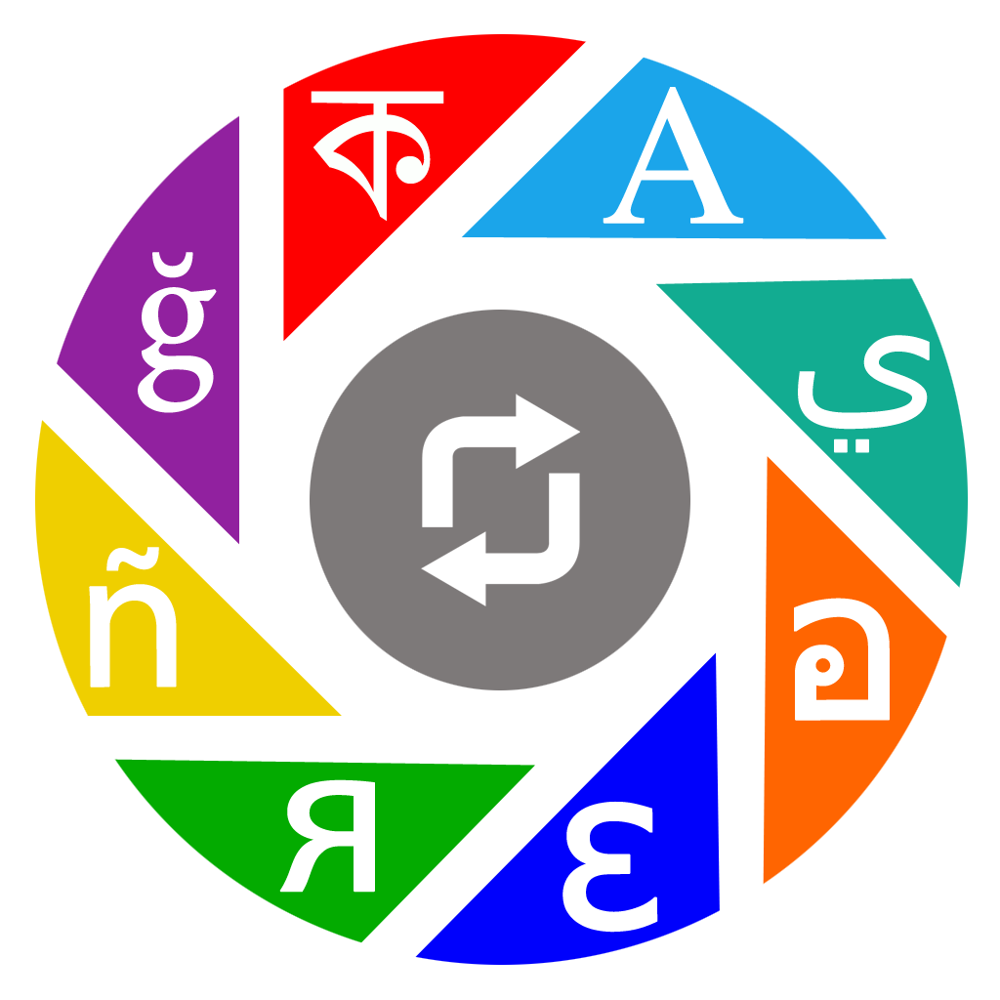
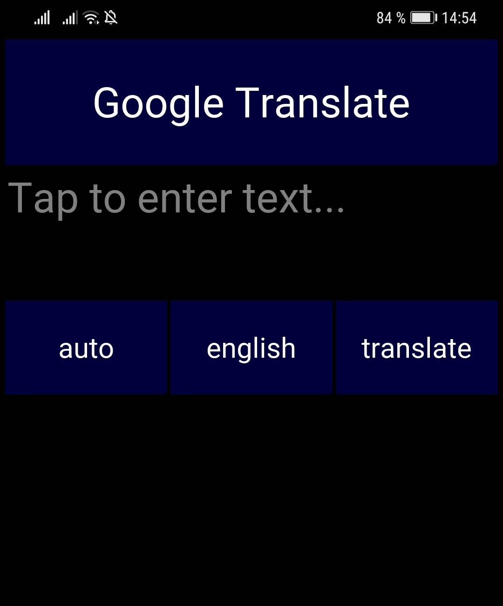
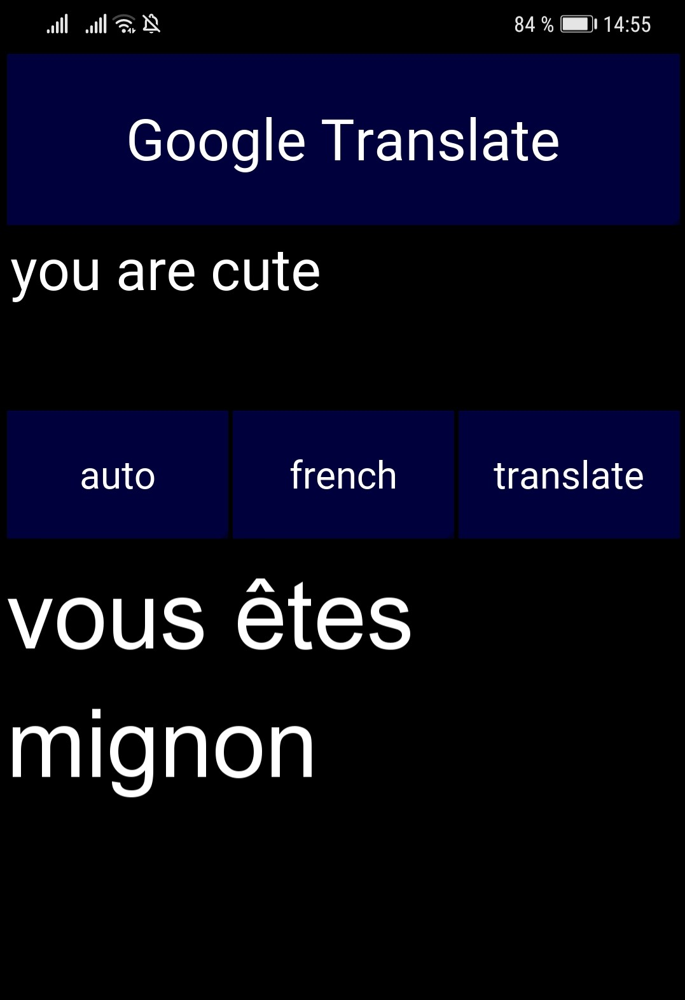
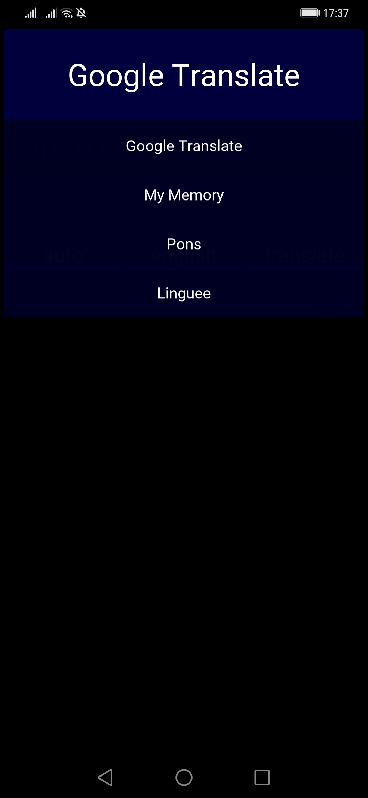
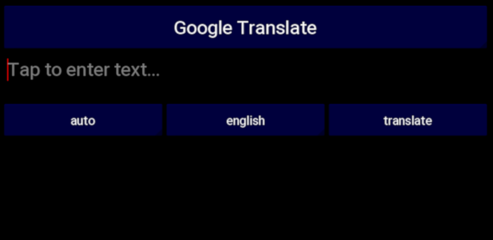

##################
deep-translator
##################

|

.. image:: https://img.shields.io/pypi/v/deep-translator.svg
        :target: https://pypi.python.org/pypi/deep-translator
.. image:: https://img.shields.io/travis/nidhaloff/deep-translator.svg
        :target: https://github.com/nidhaloff/deep-translator/actions/workflows/build.yml
.. image:: https://readthedocs.org/projects/deep-translator/badge/?version=latest
        :target: https://deep-translator.readthedocs.io/en/latest/?badge=latest
        :alt: Documentation Status
.. image:: https://img.shields.io/pypi/l/deep-translator
        :target: https://pypi.python.org/pypi/deep-translator

.. image:: https://img.shields.io/pypi/status/deep-translator
        :target: https://pypi.python.org/pypi/deep-translator

.. image:: https://pepy.tech/badge/deep-translator
    :target: https://pepy.tech/project/deep-translator

.. image:: https://img.shields.io/pypi/wheel/deep-translator
        :target: https://pypi.python.org/pypi/deep-translator

.. image:: https://img.shields.io/twitter/url?url=https%3A%2F%2Ftwitter.com%2FNidhalBaccouri
        :alt: Twitter URL
        :target: https://twitter.com/NidhalBaccouri

=======================
Translation for humans
=======================

A flexible **FREE** and **UNLIMITED** tool to translate between different languages in a simple way using multiple translators.

* Free software: MIT license
* Documentation: https://deep-translator.readthedocs.io.

|
|

.. contents:: Table of Contents
    :depth: 3

|
|

==========
Motivation
==========

I needed to translate a text using python. It was hard to find a simple way to do it.
There are other libraries that can be used for this task, but most of them
are **buggy, not free, limited, not supported anymore or complex to use.**

Therefore, I decided to build this simple tool. It is 100% free, unlimited, easy to use and provide
support for all languages.

Basically, my goal was to integrate support for multiple famous translators
in this tool.

======================
When you should use it
======================

- If you want to translate text using python
- If you want to translate from a file
- If you want to get translations from many sources and not only one
- If you want to automate translations
- If you want to compare different translations
- If you want to detect language automatically

======================
Why you should use it
======================

- It's the only python tool that integrates many translators
- multi language support
- supports batch translation
- High level of abstraction
- Automatic language detection
- Easy to use and extend
- Support for most famous universal translators
- Stable and maintained regularly
- The API is very easy to use
- Proxy integration is supported

========
Features
========

* Support for `google translate <https://translate.google.com/>`_
* Support for the `microsoft translator <https://www.microsoft.com/en-us/translator//>`_ (version >= 1.3.5)
* Support for `Pons translator <https://de.pons.com/>`_
* Support for the `Linguee translator <https://www.linguee.com/>`_
* Support for the `Mymemory translator <https://mymemory.translated.net/>`_
* Support for the `Yandex translator <https://yandex.com/>`_ (version >= 1.2.1)
* Support for the `QCRI translator <https://mt.qcri.org/api/>`_ (version >= 1.2.4)
* Support for the `DeepL translator <https://www.deepl.com/en/translator/>`_ (version >= 1.2.5)
* Support for the `Papago translator <https://papago.naver.com/>`_ (version >= 1.4.4)
* Support for the `Libre translator <https://libretranslate.com/>`_
* Support for proxy usage
* Automatic single language detection
* Batch language detection
* Translate directly from a text file
* Get multiple translation for a word
* Automate the translation of different paragraphs in different languages
* Translate directly from terminal (version >= 1.1.0)

=============
Installation
=============

Install the stable release:

.. code-block:: console

    $ pip install -U deep-translator

take a look at the docs if you want to install from source.

============
Quick Start
============

.. code-block:: python

    from deep_translator import GoogleTranslator
    translated = GoogleTranslator(source='auto', target='de').translate("keep it up, you are awesome")  # output -> Weiter so, du bist großartig

or using proxies:

.. code-block:: python

    from deep_translator import GoogleTranslator

    proxies_example = {
        "https": "34.195.196.27:8080",
        "http": "34.195.196.27:8080"
    }
    translated = GoogleTranslator(source='auto', target='de', proxies=proxies_example).translate("keep it up, you are awesome")  # output -> Weiter so, du bist großartig

or even directly from terminal:

.. code-block:: console

    $ deep-translator translate -src "en" -tgt "de" -txt "keep it up, you are awesome"

=====
Usage
=====

In this section, demos on how to use all different integrated translators in this tool are provided.

.. note::

    You can always pass the languages by the name or by abbreviation.

    *Example*: If you want to use english as a source or target language, you can pass **english** or **en** as an argument

Imports
--------

.. code-block:: python

    from deep_translator import (GoogleTranslator,
                                 MicrosoftTranslator,
                                 PonsTranslator,
                                 LingueeTranslator,
                                 MyMemoryTranslator,
                                 YandexTranslator,
                                 PapagoTranslator,
                                 DeepL,
                                 QCRI,
                                 single_detection,
                                 batch_detection)

Check Supported Languages
---------------------------

.. note::

    You can check the supported languages of each translator by calling the
    get_supported_languages function as a static method.

.. code-block:: python

    # default return type is a list
    langs_list = GoogleTranslator.get_supported_languages()  # output: [arabic, french, english etc...]

    # alternatively, you can the dictionary containing languages mapped to their abbreviation
    langs_dict = GoogleTranslator.get_supported_languages(as_dict=True)  # output: {arabic: ar, french: fr, english:en etc...}

Language Detection
------------------

.. note::

    You can also detect language automatically. Notice that this package is free and my goal is to keep it free.
    Therefore, you will need to get your own api_key if you want to use the language detection function.
    I figured out you can get one for free here: https://detectlanguage.com/documentation

- Single Text Detection

.. code-block:: python

    lang = single_detection('bonjour la vie', api_key='your_api_key')
    print(lang) # output: fr

- Batch Detection

.. code-block:: python

    lang = batch_detection(['bonjour la vie', 'hello world'], api_key='your_api_key')
    print(lang) # output: [fr, en]

Google Translate
-----------------

.. code-block:: python

    text = 'happy coding'

- You can use automatic language detection to detect the source language:

.. code-block:: python

    translated = GoogleTranslator(source='auto', target='de').translate(text=text)

- You can pass languages by name or by abbreviation:

.. code-block:: python

    translated = GoogleTranslator(source='auto', target='german').translate(text=text)

    # Alternatively, you can pass languages by their abbreviation:
    translated = GoogleTranslator(source='en', target='de').translate(text=text)

- Translate batch of texts

.. code-block:: python

    texts = ["hallo welt", "guten morgen"]

    # the translate_sentences function is deprecated, use the translate_batch function instead
    translated = GoogleTranslator('de', 'en').translate_batch(texts)

- Translate from a file:

.. code-block:: python

    translated = GoogleTranslator(source='auto', target='german').translate_file('path/to/file')

Mymemory Translator
--------------------

.. note::

    As in google translate, you can use the automatic language detection with mymemory by using "auto" as an
    argument for the source language. However, this feature in the mymemory translator is not so powerful as
    in google translate.

- Simple translation

.. code-block:: python

    text = 'Keep it up. You are awesome'

    translated = MyMemoryTranslator(source='auto', target='french').translate(text)

- Translate batch of texts

.. code-block:: python

    texts = ["hallo welt", "guten morgen"]

    # the translate_sentences function is deprecated, use the translate_batch function instead
    translated = MyMemoryTranslator('de', 'en').translate_batch(texts)

- Translate from file

.. code-block:: python

    path = "your_file.txt"

    translated = MyMemoryTranslator(source='en', target='fr').translate_file(path)

DeepL Translator
-----------------

.. note::

    In order to use the DeepL translator, you need to generate an api key. Deepl offers a Pro and a free API.
    deep-translator supports both Pro and free APIs. Just check the examples below.
    Visit https://www.deepl.com/en/docs-api/ for more information on how to generate your Deepl api key

- Simple translation

.. code-block:: python

    text = 'Keep it up. You are awesome'

    translated = DeepL(api_key="your_api_key", source="en", target="en", use_free_api=True).translate(text)

.. note::
        deep-translator uses free deepl api by default. If you have the pro version then simply set the use_free_api to false.

- Translate batch of texts

.. code-block:: python

    texts = ["hallo welt", "guten morgen"]

    # the translate_sentences function is deprecated, use the translate_batch function instead
    translated = DeepL("your_api_key").translate_batch(texts)

QCRI Translator
--------------------

.. note::

    In order to use the QCRI translator, you need to generate a free api key. Visit https://mt.qcri.org/api/
    for more information

- Check languages

.. code-block:: python

    # as a property
    print("language pairs: ", QCRI("your_api_key").languages)

- Check domains

.. code-block:: python

    # as a property
    print("domains: ", QCRI("your_api_key").domains)

- Text translation

.. code-block:: python

    text = 'Education is great'

    translated = QCRI("your_api_key").translate(source='en', target='ar', domain="news", text=text)
    # output -> التعليم هو عظيم

    # see docs for batch translation and more.

Linguee Translator
-------------------

.. code-block:: python

    word = 'good'

- Simple Translation

.. code-block:: python

    translated_word = LingueeTranslator(source='english', target='french').translate(word)

    # pass language by their abbreviation
    translated_word = LingueeTranslator(source='en', target='fr').translate(word)

- Return all synonyms or words that matches

.. code-block:: python

    # set the argument return_all to True if you want to get all synonyms of the word to translate
    translated_word = LingueeTranslator(source='english', target='french').translate(word, return_all=True)

- Translate a batch of words

.. code-block:: python

    translated_words = LingueeTranslator(source='english', target='french').translate_words(["good", "awesome"])

PONS Translator
----------------

.. note::

    You can pass the languages by the name or by abbreviation just like
    previous examples using GoogleTranslate

.. code-block:: python

    word = 'awesome'

- Simple Translation

.. code-block:: python

    translated_word = PonsTranslator(source='english', target='french').translate(word)

    # pass language by their abbreviation
    translated_word = PonsTranslator(source='en', target='fr').translate(word)

- Return all synonyms or words that matches

.. code-block:: python

    # set the argument return_all to True if you want to get all synonyms of the word to translate
    translated_word = PonsTranslator(source='english', target='french').translate(word, return_all=True)

- Translate a batch of words

.. code-block:: python

    translated_words = LingueeTranslator(source='english', target='french').translate_words(["good", "awesome"])

Yandex Translator
------------------

.. note::

    You need to require an **private api key** if you want to use the yandex translator.
    visit the official website for more information about how to get one

- Language detection

.. code-block:: python

    lang = YandexTranslator('your_api_key').detect('Hallo, Welt')
    print(f"language detected: {lang}")  # output -> language detected: 'de'

- Text translation

.. code-block:: python

    # with auto detection | meaning provide only the target language and let yandex detect the source
    translated = YandexTranslator('your_api_key').translate(source="auto", target="en", text='Hallo, Welt')
    print(f"translated text: {translated}")  # output -> translated text: Hello world

    # provide source and target language explicitly
    translated = YandexTranslator('your_api_key').translate(source="de", target="en", text='Hallo, Welt')
    print(f"translated text: {translated}")  # output -> translated text: Hello world

- File translation

.. code-block:: python

    translated = YandexTranslator('your_api_key').translate_file(source="auto", target="en", path="path_to_your_file")

- Batch translation

.. code-block:: python

    translated = YandexTranslator('your_api_key').translate_batch(source="auto", target="de", batch=["hello world", "happy coding"])

Microsoft Translator
---------------------

.. note::

    You need to require an **api key** if you want to use the microsoft translator.
    visit the official website for more information about how to get one.
    Microsoft offers a free tier 0 subscription (2 million characters per month).

- Required and optional attributes

    There are two required attributes, namely "api_key" (string) and "target" (string or list).
    Attribute "source" is optional.
    Also, Microsoft API accepts a number of other optional attributes, you can find them here:  https://docs.microsoft.com/azure/cognitive-services/translator/reference/v3-0-translate
    You can simply add them after the required attributes, see the example.

.. code-block:: python

    text = 'happy coding'
    translated = MicrosoftTranslator(api_key='some-key', target='de').translate(text=text)
    translated_two_targets = MicrosoftTranslator(api_key='some-key', target=['de', 'ru']).translate(text=text)
    translated_with_optional_attr = MicrosoftTranslator(api_key='some-key', target='de', textType='html']).translate(text=text)

- You can pass languages by name or by abbreviation:

.. code-block:: python

    translated = MicrosoftTranslator(api_key='some-key', target='german').translate(text=text)

    # Alternatively, you can pass languages by their abbreviation:
    translated = MicrosoftTranslator(api_key='some-key', target='de').translate(text=text)

- Translate batch of texts

.. code-block:: python

    texts = ["hallo welt", "guten morgen"]
    translated = MicrosoftTranslator(api_key='some-key', target='english').translate_batch(texts)

- Translate from a file:

.. code-block:: python

    translated = MicrosoftTranslator(api_key='some-key', target='german').translate_file('path/to/file')

Papago Translator
---------------------

.. note::

    You need to require a **client id** and **client secret key** if you want to use the papago translator.
    visit the official website for more information about how to get one.

.. code-block:: python

    text = 'happy coding'
    translated = PapagoTranslator(client_id='your_client_id', secret_key='your_secret_key', source='en', target='ko').translate(text=text)  # output: 행복한 부호화

Libre Translator
---------------------

.. note::

    Libre translate has multiple  `mirrors <https://github.com/LibreTranslate/LibreTranslate#mirrors>`_ which can be used for the API endpoint.
    Some require an API key to be used. By default the base url is set to `libretranslate.de <https://libretranslate.de/>`_ . 
    This can be set using the "base_url" input parameter.

.. code-block:: python

    text = 'laufen'
    translated = LibreTranslator(source='auto', target='en', base_url = 'https://libretranslate.com/', api_key = 'your_api_key').translate(text=text)  # output: run

- You can pass languages by name or by abbreviation:

.. code-block:: python

    translated = LibreTranslator(source='german', target='english').translate(text=text)

    # Alternatively, you can pass languages by their abbreviation:
    translated = LibreTranslator(source='de', target='en').translate(text=text)

- Translate batch of texts

.. code-block:: python

    texts = ["hallo welt", "guten morgen"]
    translated = LibreTranslator(source='auto', target='en').translate_batch(texts)

- Translate from a file:

.. code-block:: python

    translated = LibreTranslator(source='auto', target='en').translate_file('path/to/file')
    
    

Proxy usage
-------------

deep-translator provide out of the box usage of proxies. Just define your proxies config as a dictionary
and pass it to the corresponding translator. Below is an example using the GoogleTranslator but this feature
can be used with all supported translators.

.. code-block:: python

    from deep_translator import GoogleTranslator

    # define your proxy configs:
    proxies_example = {
        "https": "your https proxy",  # example: 34.195.196.27:8080
        "http": "your http proxy if available"
    }
    translated = GoogleTranslator(source='auto', target='de', proxies=proxies_example).translate("this package is awesome")

Usage from Terminal
--------------------

Deep-translator supports a series of command line arguments for quick and simple access to the translators directly in your console.

.. note::

    The program accepts ``deep-translator`` or ``dt`` as a command, feel free to substitute whichever you prefer.

For a list of available translators:

.. code-block:: console

    $ deep-translator list

To translate a string or line of text:

.. code-block:: console

    $ deep_translator google --source "english" --target "german" --text "happy coding"

Alternate short option names, along with using language abbreviations:

.. code-block:: console

    $ deep_translator google -src "en" -tgt "de" -txt "happy coding"

Finally, to retrieve a list of available languages for a given translator:

.. code-block:: console

    $ deep-translator languages google

======
Tests
======

Developers can install the development version of deep-translator and execute unit tests to verify functionality. For more information on doing this, see `the contribution guidelines <https://deep-translator.readthedocs.io/en/latest/contributing.html/>`_

========
Links
========
Check this article on medium to know why you should use the deep-translator package and how to translate text using python.
https://medium.com/@nidhalbacc/how-to-translate-text-with-python-9d203139dcf5

======
Help
======

If you are facing any problems, please feel free to open an issue.
Additionally, you can make contact with the author for further information/questions.

Do you like deep-translator?
You can always help the development of this project by:

- Following on github and/or twitter
- Promote the project (ex: by giving it a star on github)
- Watch the github repo for new releases
- Tweet about the package
- Help others with issues on github
- Create issues and pull requests
- Sponsor the project

==========
Next Steps
==========

Take a look in the examples folder for more :)
Contributions are always welcome.
Read the Contribution guidelines `Here <https://deep-translator.readthedocs.io/en/latest/contributing.html/>`_

==========
Credits
==========

Many thanks to @KirillSklyarenko for his work on integrating the microsoft translator

==========
License
==========

MIT license

Copyright (c) 2020-present, Nidhal Baccouri

===========================
The Translator++ mobile app
===========================

After developing the deep-translator, I realized how cool this would be if I can use it as an app on my mobile phone.
Sure, there is google translate, pons and linguee apps etc.. but isn't it cooler to make an app where all these
translators are integrated?

Long story short, I started working on the app. I decided to use the `kivy framework <https://kivy.org/#home/>`_ since
I wanted to code in python and to develop a cross platform app.
I open sourced the `Translator++ app <https://github.com/nidhaloff/deep-translator-app/>`_ on my github too.
Feel free to take a look at the code or make a pull request ;)

.. note::
    The Translator++ app is based on the deep-translator package. I just built the app to prove the capabilities
    of the deep-translator package ;)

I published the first release on google play store on 02-08-2020

Here are some screenshots:

- Phone

- Tablet:

